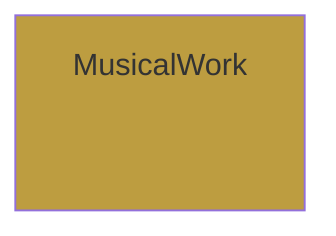

::default::

# Aggregate


```mermaid
flowchart TB 

MusicalWork[MusicalWork\n\n\n]:::aggregate

classDef aggregate fill:#bd9d40;
```


::right::

# Class

```java {all}
class MusicalWork() {
    
      
}

```

<CurrentPage />

