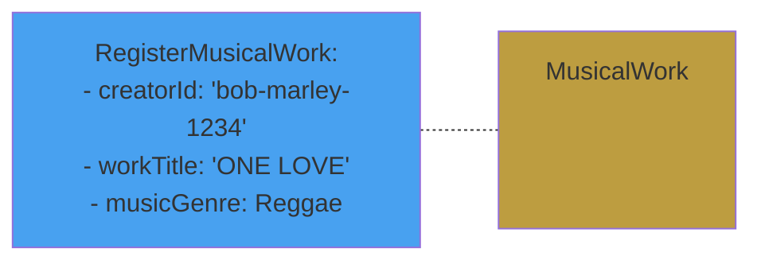

# Command on Aggregate




<v-click>

# Method in Class

```java{all}
public class MusicalWork() {
   
    public void register(CreatorId creatorId, WorkTitle title, MusicGenre genre) {


    }
}

```
</v-click>


<CurrentPage />

