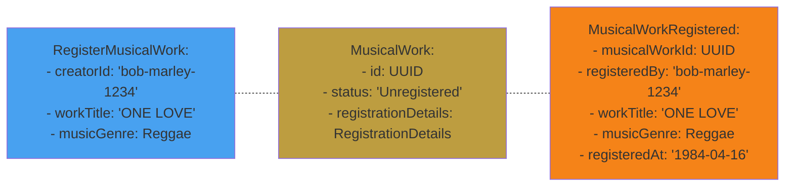

# Event from Aggregate




<v-click>

# State changes

```java{all}{maxHeight:'200px'}
public class MusicalWork {
    private MusicalWorkId id;
    private Status status = Status.Unregistered;
    private RegistrationDetails registrationDetails;
    
    public void register(CreatorId creatorId, WorkTitle title, MusicGenre musicGenre) {
        this.id = MusicalWorkId.next();
        this.registrationDetails = new RegistrationDetails(creatorId, title, musicGenre, RegistrationDate.now());
        this.status = Status.Registered;
    }
    
    static enum Status {
        Unregistered, Registered
    } 
}
```
</v-click>


<CurrentPage />

