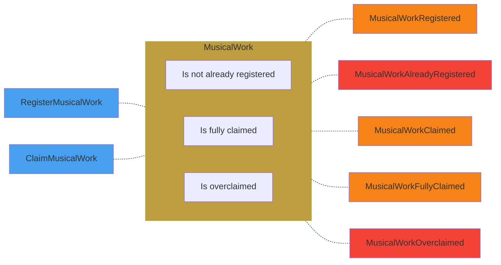

# Design Level Event Storming

```mermaid
flowchart LR

RegisterMusicalWork:::command
ClaimMusicalWork:::command

MusicalWorkRegistered:::event
MusicalWorkClaimed:::event
MusicalWorkFullyClaimed:::event

MusicalWorkOverclaimed:::error
MusicalWorkAlreadyRegistered:::error

subgraph MusicalWork[MusicalWork]
direction LR

NotRegisteredYet[Is not already registered]

FullyClaimed[Is fully claimed]

Overclaim[Is overclaimed]


end

style MusicalWork fill:#bd9d40;


RegisterMusicalWork-.-MusicalWork
ClaimMusicalWork-.-MusicalWork


MusicalWork-.-MusicalWorkRegistered
MusicalWork-.-MusicalWorkAlreadyRegistered

MusicalWork-.-MusicalWorkClaimed
MusicalWork-.-MusicalWorkFullyClaimed
MusicalWork-.-MusicalWorkOverclaimed

linkStyle 0 stroke:#2b3846,color:red;
linkStyle 1 stroke:#2b3846,color:red;
linkStyle 2 stroke:#2b3846,color:red;
linkStyle 3 stroke:#2b3846,color:red;
linkStyle 4 stroke:#2b3846,color:red;
linkStyle 5 stroke:#2b3846,color:red;
linkStyle 6 stroke:#2b3846,color:red;

classDef event fill:#f58318;
classDef aggregate fill:#bd9d40;
classDef command fill:#48a1f0;
classDef error fill:#f44336;
```

<CurrentPage />