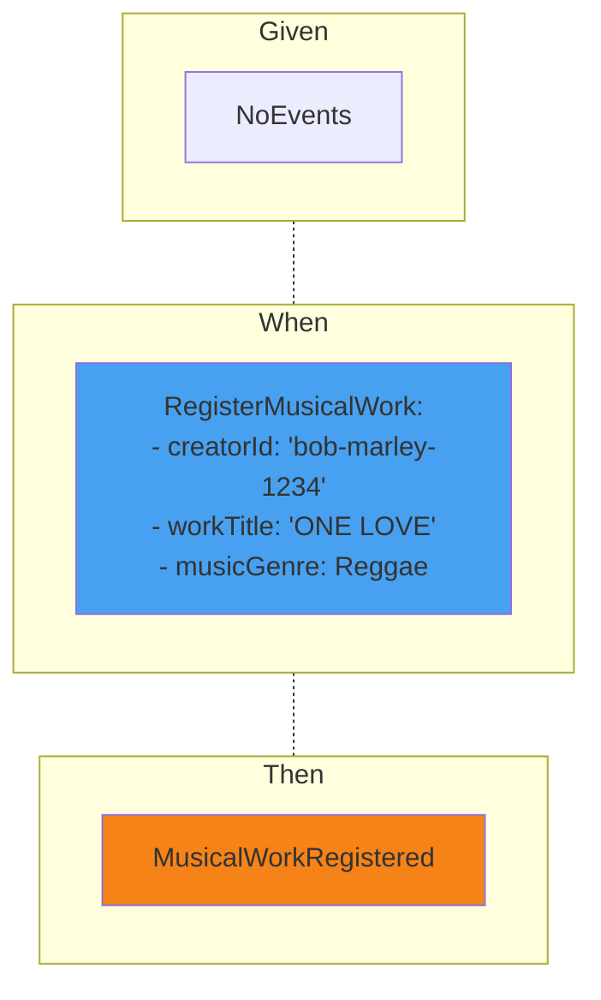

::default::

# Example Mapping
#### Register Musical Work Exploration

1. What is required to register musical work?

2. Could you provide some example values used for registration?

> We need to know who (the creator), under what title and genre is want to register musical work - Jakub (Copyright Officer)
> 

 
 
 

How to model creatorId, workTitle, musicGenre?

::right::

<CurrentPage />