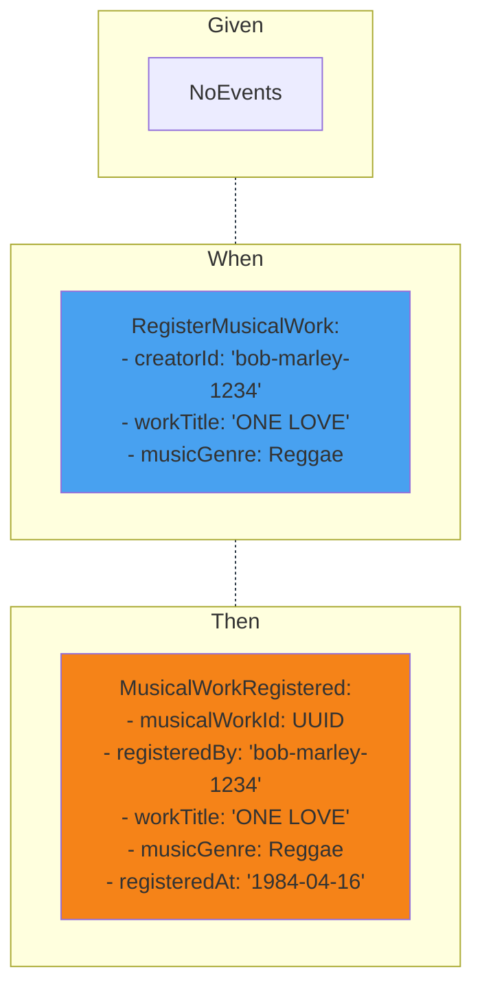

::default::

# Example Mapping
#### Musical Work Registered

1. What does it mean that musical work is registered?

2. How can we reference a registered musical work?

3. What is changing after registration?

> After successful musical work registration, work status changes to registered, and we are able to locate work to see registration details like: title, genre, who and when registered it - Jakub (Copyright Officer)

::right::

<CurrentPage />