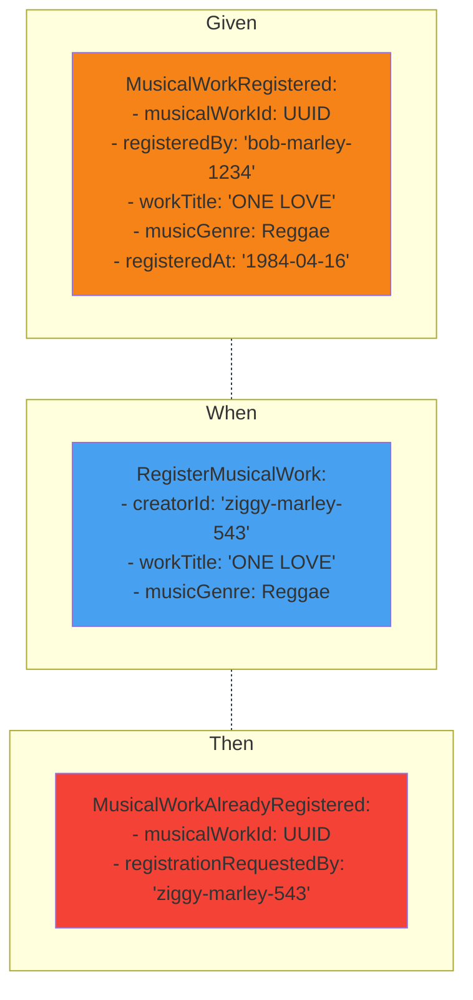

::default::

# Example Mapping
#### Already Registered exploration

1. What should happen if work is registered for the second time?

> It should not be allowed and may lead to ambiguity. We would like to be informed about such situation - J.

2. About what details you would like to be informed?

> Musical work id and creator how tried it should be enough - J.

::right::

<CurrentPage />