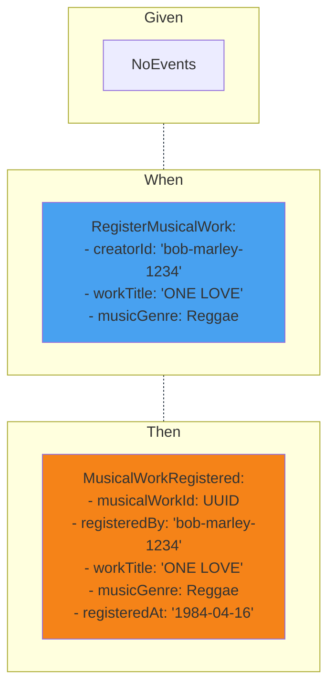

::default::

# Example Mapping
#### Register new Musical Work 

```mermaid{scale: 0.6}
flowchart TB 

subgraph Given[Given]
direction LR

NoEvents

end


subgraph When[When]
direction LR

RegisterMusicalWork[RegisterMusicalWork:\n- creatorId: 'bob-marley-1234'\n- workTitle: 'ONE LOVE'\n- musicGenre: Reggae]:::command

end


subgraph Then[Then]
direction LR

MusicalWorkRegistered[MusicalWorkRegistered:\n- musicalWorkId: UUID\n- registeredBy: 'bob-marley-1234'\n- workTitle: 'ONE LOVE'\n- musicGenre: Reggae\n- registeredAt: '1984-04-16' ]:::event

end

Given-.-When
When-.-Then

linkStyle 0 stroke:#2b3846,color:red;
linkStyle 1 stroke:#2b3846,color:red;

classDef event fill:#f58318;
classDef command fill:#48a1f0;
```

<CurrentPage />