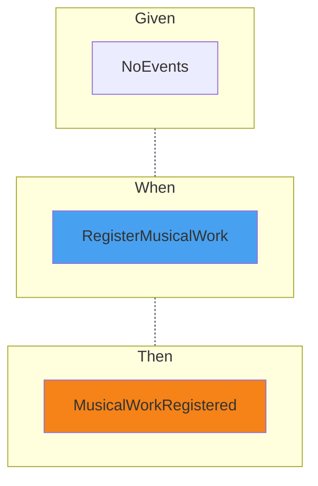

# Example mapping

#### Register new Musical Work

```mermaid
flowchart TB 

subgraph Given[Given]
direction LR

NoEvents

end


subgraph When[When]
direction LR

RegisterMusicalWork:::command

end


subgraph Then[Then]
direction LR

MusicalWorkRegistered:::event

end

Given-.-When
When-.-Then

linkStyle 0 stroke:#2b3846,color:red;
linkStyle 1 stroke:#2b3846,color:red;

classDef event fill:#f58318;
classDef command fill:#48a1f0;
classDef error fill:#f44336;
```

<CurrentPage />