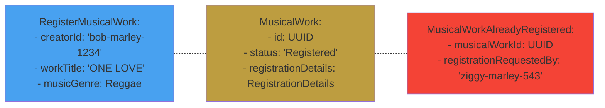

# Example Mapping == Test Case
#### Already Registered Exploration


```groovy{all}{maxHeight:'400px'}
    
    def "should not register already registered musical work"() {
        given:
        musicalWorkRegistered("bob-marley-1234", "One Love", MusicGenre.Reggae)

        when:
        registerMusicalWork("ziggy-marley-543", "One Love", MusicGenre.Reggae)

        then:
        def musicalWorkAlreadyRegistered = thrown(MusicalWorkAlreadyRegistered)
        musicalWorkAlreadyRegistered.registrationRequestedBy == new CreatorId("ziggy-marley-543")
    }
   
```


<CurrentPage />

---
class: 'text-white'
layout: full
title: Coding rules
lineNumbers: true
highlighter: shiki
hideInToc: true
---
# Invariant in Aggregate




<v-click>

# If Statements

```java{all}{maxHeight:'200px'}
public class MusicalWork {
    private MusicalWorkId id;
    private Status status = Status.Unregistered;
    private RegistrationDetails registrationDetails;

    public void register(CreatorId creatorId, WorkTitle title, MusicGenre musicGenre) {
        if (isRegistered()) {
            throw new MusicalWorkAlreadyRegistered(id, creatorId);
        }
        
        this.id = MusicalWorkId.next();
        this.registrationDetails = new RegistrationDetails(creatorId, title, musicGenre, RegistrationDate.now());
        this.status = Status.Registered;
    }
    
    Boolean isRegistered() {
        return status == Status.Registered;
    }
}
```
</v-click>


<CurrentPage />
