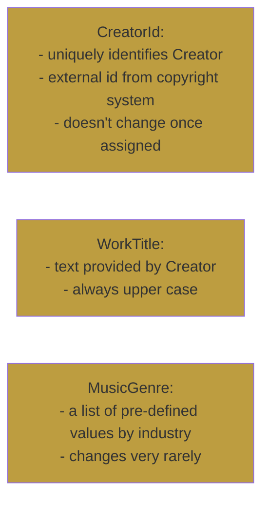

::default::

# Value object





::right::

<div v-click="1">

# Immutable Class

```java {all}
public record CreatorId(String value) { }
```
<br/>
<br/>

```java {all}
public record WorkTitle(String value) {

    public WorkTitle {
        value = value.toUpperCase();
    }
}
```
<br />

```java {all}
public enum MusicGenre {
    Pop, Reggae, Rock, Metal, 
    Jazz, Rap, Classic
}
```

</div>


<CurrentPage />

