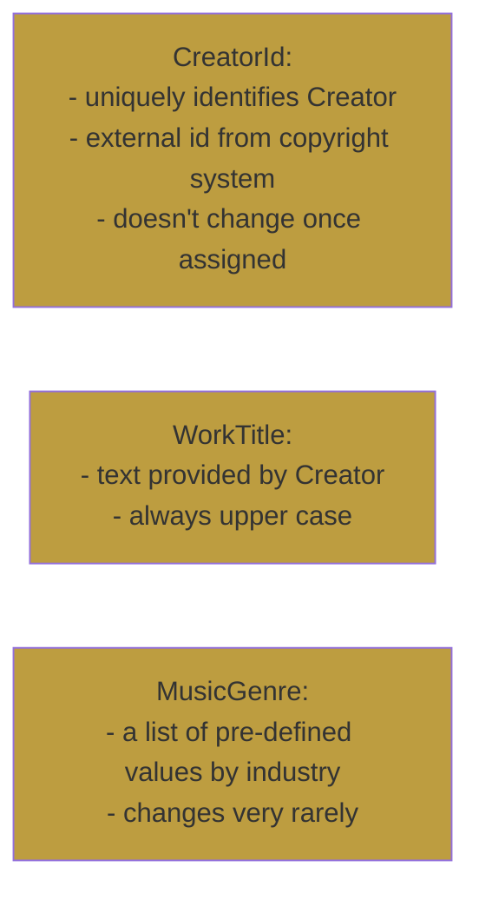

::right::

# Value object

::default::

# Exploration

1. What is the source of creator id? How frequent are changes?

> It comes from external system. Once assigned it doesn't change - J.

2. Is work title any text?

> No, it's text provided by creator, and it's always represented in copyright in upper-case - J.

3. Where do we can find possible values for music genre?

> That's easy - it's a standardised list of values- J.

<CurrentPage />

